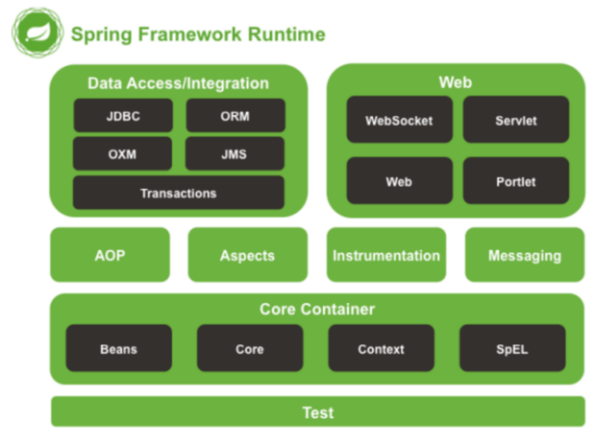

# 第一章，SpringFramework介绍

# 一 Spring和SoringFramework感念

## **1.1广义上的Spring**

**广义上的 Spring 泛指以 Spring Framework 为基础的 Spring 技术栈。**

经过十多年的发展，Spring 已经不再是一个单纯的应用框架，而是逐渐发展成为一个由多个不同子项目（模块）组成的成熟技术，例如 Spring Framework、Spring MVC、SpringBoot、Spring Cloud、Spring Data、Spring Security 等，其中 Spring Framework 是其他子项目的基础。

这些子项目涵盖了从企业级应用开发到云计算等各方面的内容，能够帮助开发人员解决软件发展过程中不断产生的各种实际问题，给开发人员带来了更好的开发体验。

## 1.2 狭义的 Spring

**狭义的 Spring 特指 Spring Framework，通常我们将它称为 Spring 框架。**

Spring Framework（Spring框架）是一个开源的应用程序框架，由SpringSource公司开发，最初是为了解决企业级开发中各种常见问题而创建的。它提供了很多功能，例如：依赖注入（Dependency Injection）、面向切面编程（AOP）、声明式事务管理（TX）等。其主要目标是使企业级应用程序的开发变得更加简单和快速，并且Spring框架被广泛应用于Java企业开发领域。

Spring全家桶的其他框架都是以SpringFramework框架为基础！

# 二 SpringFramework的主要功能

SpringFramework框架结构图：

| 功能模块       | 功能介绍                                                    |
| -------------- | ----------------------------------------------------------- |
| Core Container | 核心容器，在 Spring 环境下使用任何功能都必须基于 IOC 容器。 |
| AOP&Aspects    | 面向切面编程                                                |
| TX             | 声明式事务管理。                                            |
| Spring MVC     | 提供了面向Web应用程序的集成功能。                           |

# 三 SpringFramewor的优势

1. 简化 Java 开发：Spring Framework 简化了 Java 开发，提供了各种工具和 API，可以降低开发复杂度和学习成本。同时，Spring Framework 支持各种应用场景，包括 Web 应用程序、RESTful API、消息传递、批处理等等。
2. Spring 使创建 Java 企业应用程序变得容易。它提供了在企业环境中采用 Java 语言所需的一切，支持 Groovy 和 Kotlin 作为 JVM 上的替代语言，并且可以根据应用程序的需求灵活地创
3. 模块化的设计：框架组件之间的松散耦合和模块化设计使得 Spring Framework 具有良好的可重用性、可扩展性和可维护性。开发人员可以轻松地选择自己需要的模块，根据自己的需求进行开发。