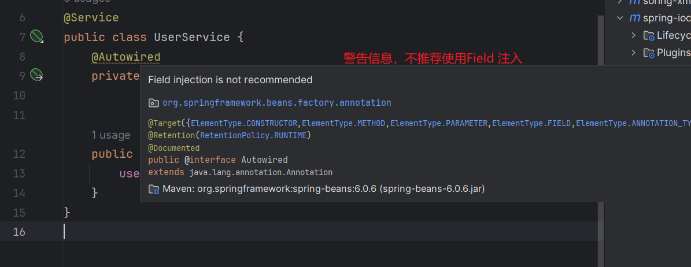

# 第三章 SpringIOC容器的使用

# 一 SpringIOC容器的实现步骤

### 1. **编写元数据（配置）**

既是编写交给SpringIoC容器管理组件的信息，配置方式有三种。xml，注解以及配置类。

以下是xml方式配置元数据。

```xml
<?xml version="1.0" encoding="UTF-8"?>
<!-- 此处要添加一些约束，配置文件的标签并不是随意命名 -->
<beans xmlns="http://www.springframework.org/schema/beans"
  xmlns:xsi="http://www.w3.org/2001/XMLSchema-instance"
  xsi:schemaLocation="http://www.springframework.org/schema/beans
    https://www.springframework.org/schema/beans/spring-beans.xsd">

  <bean id="..." [1] class="..." [2]>  
    <!-- collaborators and configuration for this bean go here -->
  </bean>

  <bean id="..." class="...">
    <!-- collaborators and configuration for this bean go here -->
  </bean>
  <!-- more bean definitions go here -->
</beans>
```

<bean /> 标签 == 组件信息声明

- `id` 属性是标识单个 Bean 定义的字符串。

- `class` 属性定义 Bean 的类型并使用完全限定的类名。

### 2. **创建IOC容器**

即实例化IOC容器，有四种实现类，`ClassPathXmlApplicationContext`,`FileSystemXmlApplicationContext`,`AnnotationConfigApplication`,`WebApplicationContext`前面已经介绍。

以下是用ClassPathXmlApplicationContext 类实例化IOC容器

```java
//实例化ioc容器,读取外部配置文件,最终会在容器内进行ioc和di动作
ApplicationContext context = 
           new ClassPathXmlApplicationContext("services.xml", "daos.xml");
```


### 3. **通过IOC容器获得组件**

   `ApplicationContext` 是一个高级工厂的接口，能够维护不同 bean 及其依赖项的注册表。通过使用方法 `T getBean(String name, Class<T> requiredType)` ，您可以检索 bean 的实例。

   允许读取 Bean 定义并访问它们，如以下示例所示：

   ```Java
   //创建ioc容器对象，指定配置文件，ioc也开始实例组件对象
   ApplicationContext context = new ClassPathXmlApplicationContext("services.xml", "daos.xml");
   //获取ioc容器的组件对象
   PetStoreService service = context.getBean("petStore", PetStoreService.class);
   //使用组件对象
   List<String> userList = service.getUsernameList();
   ```

# 二 XML配置方式管理组件

## 2.1 组件(bean)的注册

使用xml配置注册组件(bean)**思路:**

1. 准备好自定义的类
2. 导入spring依赖
3. 编写元数据配置bean

具体实现:

 1. 准备项目 

    a.创建maven工程

    b.导入springIOC相关依赖

    ​	pom.xml
```xml
  <!--spring context依赖-->
    <!--当你引入Spring Context依赖之后，表示将Spring的基础依赖引入了-->
    <dependency>
        <groupId>org.springframework</groupId>
        <artifactId>spring-context</artifactId>
        <version>6.0.6</version>
    </dependency>
```

2. 对于无参构造器bean的注册

   a. 自定义java类

   ```java
   public class Component {
       public Component() {
       }
   }
   ```

   b. 编写配置文件 resource/xxx.xml

   ​	首先添加spring约束

   ```xml
   <?xml version="1.0" encoding="UTF-8"?>
   <beans xmlns="http://www.springframework.org/schema/beans"
          xmlns:xsi="http://www.w3.org/2001/XMLSchema-instance"
          xsi:schemaLocation="http://www.springframework.org/schema/beans http://www.springframework.org/schema/beans/spring-beans.xsd">
   
   </beans>
   ```

   在idea中约束可以自动生成,如下图(前提是已经导入了spring-context依赖)

   

   c.在spring配置文件中编写<bean>标签注册bean

   ```xml
    <bean id="component" class="com.ls.ioc_01.Component"/>
   ```

   

## 2.2 组件(bean)的依赖注入

   **通过配置文件,实现IOC容器中bean的赋值已经引用(依赖注入DI),有两种场景,基于构造函数依赖注入,和基于setter依赖注入**

思路


### 2.2.1基于构造函数的依赖注入

#### A. 单个构造参数注入

准备组件

```java
public class UserDao {
}


public class UserService {
    
    private UserDao userDao;

    public UserService(UserDao userDao) {
        this.userDao = userDao;
    }
}
```

添加spring约束编写配置bean

```xml
<?xml version="1.0" encoding="UTF-8"?>
<beans xmlns="http://www.springframework.org/schema/beans"
       xmlns:xsi="http://www.w3.org/2001/XMLSchema-instance"
       xsi:schemaLocation="http://www.springframework.org/schema/beans http://www.springframework.org/schema/beans/spring-beans.xsd">

<!--    基于构造器进行依赖注入（单个参数）-->
<!--    首先要确保两个组件都要在[ioc]容器中
         在需要进行DI的组件中 用<constructor-arg>标签来赋值
                    ref ： 引用ioc中其他组件    其他bean的id
                    value： 就是普通值
 -->
<!--    tips： 组件的先后顺序无所谓，因为ioc容器会先创建组件，然后在赋值（DI）-->

    <bean id="userDao" class="com.ls.ioc_02.UserDao"/>
    <bean id="userService" class="com.ls.ioc_02.UserService">
        <constructor-arg ref="userDao"/>
    </bean>
</beans>
```

#### B 多个构造参数注入

准备组件

```java
public class UserDao {
}

public class UserService {
    private UserDao userDao;
    private int age;
    private String name;

    public UserService(UserDao userDao, int age, String name) {
        this.userDao = userDao;
        this.age = age;
        this.name = name;
    }
}
```

添加spring约束并编写配置文件

有三种方式DI,推荐使用参数名注入

```xml
<?xml version="1.0" encoding="UTF-8"?>
<beans xmlns="http://www.springframework.org/schema/beans"
       xmlns:xsi="http://www.w3.org/2001/XMLSchema-instance"
       xsi:schemaLocation="http://www.springframework.org/schema/beans http://www.springframework.org/schema/beans/spring-beans.xsd">

<!--    多个参数构造器注入-->
    <bean id="userDao" class="com.ls.ioc_03.UserDao"/>
<!--   按照参数的顺序DI -->
    <bean id="userService" class="com.ls.ioc_03.UserService">
        <constructor-arg value="20"/>
        <constructor-arg value="ls"/>
        <constructor-arg ref="userDao"/>
    </bean>

<!--    通过参数的名赋值-->
    <bean id="userService" class="com.ls.ioc_03.UserService">
        <constructor-arg name = "age" value="20"/>
        <constructor-arg name="name" value="ls"/>
        <constructor-arg name="userDao" ref="userDao"/>
    </bean>

<!--通过参数下标赋值  从0开始  从左开始-->
    <bean id="userService" class="com.ls.ioc_03.UserService">
        <constructor-arg index="0" value="20"/>
        <constructor-arg index="1" value="ls"/>
        <constructor-arg index="2" ref="userDao"/>
    </bean>
</beans>
```
### 2.2.2基于setter方法注入

开发中，除了构造函数注入（DI）更多的使用的Setter方法进行注入！

准备组件

```java
public class UserDao {
}
public class UserService {
    private String name;

    private UserDao userDao;

    public void setName(String name) {
        this.name = name;
    }

    public void setUserDao(UserDao userDao) {
        this.userDao = userDao;
    }
}

```

添加spring约束并编写配置文件

```xml
<?xml version="1.0" encoding="UTF-8"?>
<beans xmlns="http://www.springframework.org/schema/beans"
       xmlns:xsi="http://www.w3.org/2001/XMLSchema-instance"
       xsi:schemaLocation="http://www.springframework.org/schema/beans http://www.springframework.org/schema/beans/spring-beans.xsd">

<!--    基于setter方法DI-->
<!--    确保组件类中有setter方法
            编写<property> 进行setter方法注入
                name  指的是set方法名字改为首字母小写
                          例如   setName   那么参数就是name
                value  基本类型
                ref    引用其他bean值为其他bean的id
-->


    <bean id="userDao" class="com.ls.ioc_04.UserDao"/>
    <bean id="userService" class="com.ls.ioc_04.UserService">
        <property name="name" value="ls"/>
        <property name="userDao" ref="userDao"/>
    </bean>
</beans>
```

依赖注入包括基本类型注入和引用类型注入


## 2.3 IOC的创建以及使用

了解springIoc容器的接口和实现类


**思路：**

​	通过合适的实现类创建springIOC容器

准备组件

```java
public class Dog {
    public  void   eat(){
        System.out.println("吃骨头~~");
    }
}
```

编写配置文件

```xml
   <bean id="dog" class="com.ls.ioc_05.Dog"/>
```

编写测试类，创建springioc容器并获取bean

```java
    public static void main(String[] args) {
        //方式一：直接创建容器并指定配置文件
        ClassPathXmlApplicationContext context = new ClassPathXmlApplicationContext("ioc_05.xml");

        //方式二： 先创建ioc容器，在指定配置文件，在刷新
//        ClassPathXmlApplicationContext context1 = new ClassPathXmlApplicationContext(); //创建ioc容器
//        context1.setConfigLocations("ioc_05.xml");   //配置ioc容器
//        context1.refresh();   //刷新ioc容器。
        
        Dog dog = context.getBean("dog", Dog.class);
        dog.eat();
    }
}
```

获得bean的三种方式

```java
//方式1: 根据id获取
//没有指定类型,返回为Object,需要类型转化!
HappyComponent happyComponent = 
        (HappyComponent) iocContainer.getBean("bean的id标识");
        
//方式2: 根据类型获取
//根据类型获取,但是要求,同类型(当前类,或者之类,或者接口的实现类)只能有一个对象交给IoC容器管理
//配置两个或者以上出现: org.springframework.beans.factory.NoUniqueBeanDefinitionException 问题
HappyComponent happyComponent = iocContainer.getBean(HappyComponent.class);

//方式3: 根据id和类型获取 推荐
HappyComponent happyComponent = iocContainer.getBean("bean的id标识", HappyComponent.class);

```

## 2.4周期方法和作用域

周期方法： 在程序执行的过程中，到了某一时刻和条件，方法会自动执行。就是周期方法。

如servlet，用户向浏览器发出请求，tomcat接受请求，会创建对应的servlet，servlet的init，serviece，destory方法都可以看作是周期方法


在spring中，springioc容器的创建和销毁也可以看作是周期性的方法

准备组件

```java
/**演示周期性方法
 *   方法  必须 是  public void 修饰 并且不能有参数
 */

public class JavaBean {
    public  void init(){
        //逻辑代码
        System.out.println("初始化");

    }
}
```

配置

```xml
<?xml version="1.0" encoding="UTF-8"?>
<beans xmlns="http://www.springframework.org/schema/beans"
       xmlns:xsi="http://www.w3.org/2001/XMLSchema-instance"
       xsi:schemaLocation="http://www.springframework.org/schema/beans http://www.springframework.org/schema/beans/spring-beans.xsd">

<!--    周期性方法-->
<!--    destroy-method ="方法名"
        init-method = "方法名"
                需要注意的是：方法必须有public void 修饰 并且不能有参数’
        -->

<!--    经过测验发现当ioc容器创建并实例化的时候，就执行了周期性方法 由此引入bean的作用域-->
<!--    bean的作用域
           <bean> 中scope 属性
                     singleton  在实例化ioc容器时就创建bean  默认
                     prototype  在获取bean对象的时候才会创建bean
 -->

    <bean id="javaBean" class="com.ls.ioc_06.JavaBean"  destroy-method="init" init-method="init"/>
</beans>
```

**作用域**：

bean的作用域
           <bean> 中scope 属性
                     singleton  在实例化ioc容器时就创建bean  默认
                     prototype  在获取bean对象的时候才会创建bean

1. 作用域可选值

| 取值      | 含义                                        | 创建对象的时机   | 默认值 |
| --------- | ------------------------------------------- | ---------------- | ------ |
| singleton | 在 IOC 容器中，这个 bean 的对象始终为单实例 | IOC 容器初始化时 | 是     |
| prototype | 这个 bean 在 IOC 容器中有多个实例           | 获取 bean 时     | 否     |


    如果是在WebApplicationContext环境下还会有另外两个作用域（但不常用）：

| 取值    | 含义                 | 创建对象的时机 | 默认值 |
| ------- | -------------------- | -------------- | ------ |
| request | 请求范围内有效的实例 | 每次请求       | 否     |
| session | 会话范围内有效的实例 | 每次会话       | 否     |

## 2.5 FactoryBean的特性和使用


# 三 XML配置方式管理组件综合练习

## 3.1环境搭建

1. 需求分析

    搭建一个三层架构案例，模拟查询全部学生（学生表）信息，持久层使用JdbcTemplate和Druid技术，使用XML方式进行组件管理！

    

a. 数据库准备

```java
create database studb;

use studb;

CREATE TABLE students (
  id INT PRIMARY KEY,
  name VARCHAR(50) NOT NULL,
  gender VARCHAR(10) NOT NULL,
  age INT,
  class VARCHAR(50)
);

INSERT INTO students (id, name, gender, age, class)
VALUES
  (1, '张三', '男', 20, '高中一班'),
  (2, '李四', '男', 19, '高中二班'),
  (3, '王五', '女', 18, '高中一班'),
  (4, '赵六', '女', 20, '高中三班'),
  (5, '刘七', '男', 19, '高中二班'),
  (6, '陈八', '女', 18, '高中一班'),
  (7, '杨九', '男', 20, '高中三班'),
  (8, '吴十', '男', 19, '高中二班');
```

b. 创建项目引入依赖

```xml
<dependencies>
      <!--spring context依赖-->
      <!--当你引入SpringContext依赖之后，表示将Spring的基础依赖引入了-->
      <dependency>
          <groupId>org.springframework</groupId>
          <artifactId>spring-context</artifactId>
          <version>6.0.6</version>
      </dependency>

      <!-- 数据库驱动和连接池-->
      <dependency>
          <groupId>mysql</groupId>
          <artifactId>mysql-connector-java</artifactId>
          <version>8.0.25</version>
      </dependency>

      <dependency>
          <groupId>com.alibaba</groupId>
          <artifactId>druid</artifactId>
          <version>1.2.8</version>
      </dependency>

      <!-- spring-jdbc -->
      <dependency>
          <groupId>org.springframework</groupId>
          <artifactId>spring-jdbc</artifactId>
          <version>6.0.6</version>
      </dependency>

</dependencies> 
```

c. 实体类准备

```java
public class Student {

    private Integer id;
    private String name;
    private String gender;
    private Integer age;
    private String classes;

    public Integer getId() {
        return id;
    }

    public void setId(Integer id) {
        this.id = id;
    }

    public String getName() {
        return name;
    }

    public void setName(String name) {
        this.name = name;
    }

    public String getGender() {
        return gender;
    }

    public void setGender(String gender) {
        this.gender = gender;
    }

    public Integer getAge() {
        return age;
    }

    public void setAge(Integer age) {
        this.age = age;
    }

    public String getClasses() {
        return classes;
    }

    public void setClasses(String classes) {
        this.classes = classes;
    }

    @Override
    public String toString() {
        return "Student{" +
                "id=" + id +
                ", name='" + name + '\'' +
                ", gender='" + gender + '\'' +
                ", age=" + age +
                ", classes='" + classes + '\'' +
                '}';
    }
}
```

d.jdbcTemplate技术

为了在特定领域帮助我们简化代码，Spring 封装了很多 『Template』形式的模板类。例如：RedisTemplate、RestTemplate 等等，包括 JdbcTemplate。

 **jdbcTemplate使用：**

1. 创建连接池对象 --->引入Druid

   Druid的实例化用Druid依赖提供的实现类实例化，需要填四个必要的参数

   ```java
     //0 创建一个连接池对象
           DruidDataSource druidDataSource = new DruidDataSource();
           druidDataSource.setUrl("jdbc:mysql://localhost:3306/studb");
           druidDataSource.setDriverClassName("com.mysql.cj.jdbc.Driver");
           druidDataSource.setName("root");
           druidDataSource.setPassword("root");
   ```

2. 实例化JdbcTemplate对象

   1. 引入spring-jdbc依赖，根据该依赖提供的实现类实例化

   2. 导入数据源

   3. 调用方法

   ```java
    public  void testForJava(){
           //0 创建一个连接池对象
           DruidDataSource druidDataSource = new DruidDataSource();
           druidDataSource.setUrl("jdbc:mysql://localhost:3306/studb");
           druidDataSource.setDriverClassName("com.mysql.cj.jdbc.Driver");
           druidDataSource.setName("root");
           druidDataSource.setPassword("root");
   
   
           //1. 实例化对象
           JdbcTemplate jdbcTemplate = new JdbcTemplate();
   
           //2.但是只有查询，并没有指定数据库，要先指定数据库才能对数据库操作
           //jdbcTemplate.setDataSource("数据源");
           jdbcTemplate.setDataSource(druidDataSource);
   
           //3.调用方法
           //jdbcTemplate.update() DDL DML DCL
           //jdbcTemplate.query();DQL 查询集合
           //jdbcTemplate.queryForObject(); 查询单个对象
       }
   }
   ```

   由于使用了spring框架，组件就交给soringIOC容器去管理，可简化代码的耦合度。

   

e. jdbc.properties

```.properties
jdbc.url=jdbc:mysql://localhost:3306/studb
jdbc.driver=com.mysql.cj.jdbc.Driver
jdbc.username=root
jdbc.password=root
```

f.spring配置文件的编写.

​	**外部文件引入和使用**：

		因为配置数据源射击隐私问题，通常都是写到.properties中
	    在配置数据源的时候引用文件内的数据所以要引入外部文件 value = ${key}
	    使用context:property-placeholder 引入  这个标签需要引入约束：
	              xmlns:context="http://www.springframework.org/schema/context"
	    location="类地址"
```xml
<?xml version="1.0" encoding="UTF-8"?>
<beans xmlns="http://www.springframework.org/schema/beans"
       xmlns:xsi="http://www.w3.org/2001/XMLSchema-instance"
       xmlns:context="http://www.springframework.org/schema/context"
       xsi:schemaLocation="http://www.springframework.org/schema/beans http://www.springframework.org/schema/beans/spring-beans.xsd http://www.springframework.org/schema/context https://www.springframework.org/schema/context/spring-context.xsd">


<!--    因为配置数据源射击隐私问题，通常都是写到.properties中
        在配置数据源的时候引用文件内的数据所以要引入外部文件 value = ${key}
        使用context:property-placeholder 引入  这个标签需要引入约束：
                  xmlns:context="http://www.springframework.org/schema/context"
        location="类地址"
-->

    <context:property-placeholder location="classpath:jdbc.properties"/>

<!--       jdbcTemplate 配置-->
    <bean id="jdbcTemplate" class="org.springframework.jdbc.core.JdbcTemplate">
<!--        setter方法注入  装配数据源-->
        <property name="dataSource" ref="dataSource"/>
    </bean>

<!--    druidDataSource  配置数据源-->
    <bean id="dataSource" class="com.alibaba.druid.pool.DruidDataSource">
<!--        setter方法注入-->
        <property name="url" value="${jdbc.url}"/>
        <property name="driverClassName" value="${jdbc.driver}"/>
        <property name="username" value="${jdbc.username}"/>
        <property name="password" value="${jdbc.password}"/>
    </bean>
</beans>
```

## 3.2 JdbcTemplate的使用

```java
import com.alibaba.druid.pool.DruidDataSource;
import com.ls.pojo.Student;
import org.junit.Test;
import org.springframework.context.ApplicationContext;
import org.springframework.context.support.ClassPathXmlApplicationContext;
import org.springframework.jdbc.core.BeanPropertyRowMapper;
import org.springframework.jdbc.core.JdbcTemplate;
import org.springframework.jdbc.core.RowMapper;

import java.sql.ResultSet;
import java.sql.SQLException;
import java.util.List;

/** jdbcTemplate的使用
 *     作用时简化数据库的CRUD 但是不提供连接池
 *     连接池引入 DruidDataSource 负责连接的创建和数据库驱动的注册
 *   1.实例化对象
 *   2.调用方法
 */
public class JdbcTemplateTest {

    @Test
    public  void testForJava(){
        //在springioc容器中已经将数据源注入了jdbcTemplate，减少了代码的耦合度
        ApplicationContext context = new ClassPathXmlApplicationContext("application.xml");
        JdbcTemplate jdbcTemplate = context.getBean(JdbcTemplate.class);
        //jdbcTemplate.update()方法  插入 删除  修改
        //插入一条语句
        String sql = "insert into students (id,name,gender,age,class) values(?,?,?,?,?)";
        /** 参数1： sql语句 参数可以用？ 占位符
         *  参数2： Object ....param  可变参数，依次传入值
         *  return: 改变的行数
         */
        int rows = jdbcTemplate.update(sql, 499, "ls", "男", "20", "软工二班");
        System.out.println("更改了" + rows +"行");

        //查询单条数据 jdbcTemplate.queryForObject() ，并返回对应的数据对象,映射
        sql ="select *from students where id = ?";
        /** 参数1： sql
         * 参数2： RowMapper<T>  列名和属性名的映射器接口
         *          要实现接口的方法映射 手动创建所映射的对象，然后从结果集获取值对应赋值给对象，然后返回对象
         * 参数3：object .....param
         * return :  映射的类型
         */
        Student student = jdbcTemplate.queryForObject(sql, new RowMapper<Student>() {
            @Override
            public Student mapRow(ResultSet rs, int rowNum) throws SQLException {
                //rs 是sql的结果集  rownum 行数 不在意即可
                //手动将结果集映射到实体对象上
                Student student = new Student();
                student.setId(rs.getInt("id"));
                student.setAge(rs.getInt("age"));
                student.setName(rs.getString("name"));
                student.setGender(rs.getString("gender"));
                student.setClasses(rs.getString("class"));

                return student;
            }
        }, new Object[]{1});
        System.out.println(student);

        //查询多条语句 jdbcTemplate.query()
        sql = "select id,name,gender,age,class as classes from students";

        /** 参数一： sql
         *  参数二：RowMapper<T>  列名和属性名的映射器接口，
         *             接口可以自己实现如上所示，也可以用其实现类BeanPropertyRowMapper<T>(xxx.class)
         *                  自动将结果集映射，但是前提是列明和属性名一致，如果有不一致的可以as起别名
         *                  BeanPropertyRowMapper<T>(xxx.class) 会自动映射列和属性值
         * return ： list<T>
         */
        List<Student> studentList = jdbcTemplate.query(sql, new BeanPropertyRowMapper<>(Student.class));
        System.out.println(studentList);

    }
}
```

## 3.3编写实战

基于上述搭建，写一个查询所有学生信息的业务。

三层架构结构图


**持久层：**

```java
/**
 * 操作学生类数据库的接口
 */
public interface StudentDao {

    /**
     * 查询所有学生数据
     * @return  学生集合
     */
    List<Student> findAllStudents();
}

//实现类
public class StudentDaoImp implements StudentDao {

    //使用jdbcTemplate
    private JdbcTemplate jdbcTemplate;
    //要使用setter注入 将jdbcTemplate 注入到 Dao层中
    public void setJdbcTemplate(JdbcTemplate jdbcTemplate) {
        this.jdbcTemplate = jdbcTemplate;
    }

    /**
     * 查找所有的学生信息
     * @return
     */
    @Override
    public List<Student> findAllStudents() {
        String sql = "select id,name,age,gender,class as classes from students";
        List<Student> studentList = jdbcTemplate.query(sql, new BeanPropertyRowMapper<>(Student.class));

        System.out.println(studentList);
        return studentList;
    }
}


```

**业务层：**

```java
//service 层接口
public interface StudentService {

    /**
     * 查询所有学生信息 ---业务
     * @return
     */
    List<Student> findAllStudent();
}

//实现类
public class StudentServiceImp implements StudentService {
    //需要调用Dao层服务
    private StudentDao studentDao;
    //通过setter注入
    public void setStudentDao(StudentDao studentDao) {
        this.studentDao = studentDao;
    }

    /**
     * 查询所有学生信息 业务的实现
     * @return
     */
    @Override
    public List<Student> findAllStudent() {
        List<Student> allStudents = studentDao.findAllStudents();
        System.out.println("Service层----"+allStudents);
        return allStudents;
    }
}
```

**表述层：**

```java
//控制层： 接受用户请求，处理请求参数 --->调用服务层，处理业务逻辑 --->将响应结果返回给用户（页面跳转）
public class StudentController {
    //调用服务层，处理业务逻辑
    private StudentService studentService;

    public void setStudentService(StudentService studentService) {
        this.studentService = studentService;
    }

    public  void findAll(){
        List<Student> studentList = studentService.findAllStudent();
        System.out.println("controller---------"+studentList);
    }
}
```

**springioc的依赖注入**

```xml
<?xml version="1.0" encoding="UTF-8"?>
<beans xmlns="http://www.springframework.org/schema/beans"
       xmlns:xsi="http://www.w3.org/2001/XMLSchema-instance"
       xmlns:context="http://www.springframework.org/schema/context"
       xsi:schemaLocation="http://www.springframework.org/schema/beans http://www.springframework.org/schema/beans/spring-beans.xsd http://www.springframework.org/schema/context https://www.springframework.org/schema/context/spring-context.xsd">


<!--    因为配置数据源射击隐私问题，通常都是写到.properties中
        在配置数据源的时候引用文件内的数据所以要引入外部文件 value = #{key}
        使用context:property-placeholder 引入  这个标签需要引入约束：
                  xmlns:context="http://www.springframework.org/schema/context"
        location="类地址"
-->

    <context:property-placeholder location="classpath:jdbc.properties"/>

<!--       jdbcTemplate 配置-->
    <bean id="jdbcTemplate" class="org.springframework.jdbc.core.JdbcTemplate">
<!--        setter方法注入  装配数据源-->
        <property name="dataSource" ref="dataSource"/>
    </bean>

<!--    druidDataSource  配置数据源-->
    <bean id="dataSource" class="com.alibaba.druid.pool.DruidDataSource">
<!--        setter方法注入  装配数据源-->
        <property name="url" value="${jdbc.url}"/>
        <property name="driverClassName" value="${jdbc.driver}"/>
        <property name="username" value="${jdbc.username}"/>
        <property name="password" value="${jdbc.password}"/>
    </bean>

<!--   Dao层组件   实现类-->
    <bean id="studentDao" class="com.ls.Dao.imp.StudentDaoImp">
        <property name="jdbcTemplate" ref="jdbcTemplate"/>
    </bean>
<!--    Service 层组件-->
    <bean id="studentServiceImp" class="com.ls.service.imp.StudentServiceImp">
        <!--        注入 Dao的实现类-->
        <property name="studentDao" ref="studentDao"/>
    </bean>
    <!--        Controller 层组件-->
    <bean id="studentController" class="com.ls.controller.StudentController">
        <property name="studentService" ref="studentServiceImp"/>

    </bean>
</beans>
```


测试代码

```java
public class MvcPractice {
    public static void main(String[] args) {
        ApplicationContext applicationContext =
                new ClassPathXmlApplicationContext("application.xml");

        //发送请求，controller接受请求
        StudentController controller = applicationContext.getBean(StudentController.class);
        controller.findAll();
    }
}

```


**XMLIoC方式问题总结**

优点：创建对象交给springioc容器管理确实减少了代码耦合度。

缺点：

1. 注入的属性必须添加setter方法、代码结构乱！
2. 配置文件和Java代码分离、编写不是很方便！
3. XML配置文件解析效率低


# 四 基于注解方式使用SpringIoc

和 XML 配置文件一样，注解本身并不能执行，注解本身仅仅只是做一个标记，具体的功能是框架检测到注解标记的位置，然后针对这个位置按照注解标记的功能来执行具体操作。

本质上：所有一切的操作都是 Java 代码来完成的，XML 和注解只是告诉框架中的 Java 代码如何执行。

## 4.1 组件（Bean）的注册

思路： 使用注解标记组件，让spring框架识别注解并管理组件。

由于效率原因，spring框架并不会扫描所有的包，去寻找注解，这样效率很低。所以需要我们去告知spring，我们在那些包内使用了注解或者想要springioc管理的组件。

所以组件的注册分为两步： **1.添加注解，2.告知spring添加注解的包，即包扫描**

**ps:在使用第三方类的时候，如JdbcTemplate类，就无法使用注解去注册，还是要使用xml方式配置**

### 4.1.1添加注解

Spring 提供了以下多个注解，这些注解可以直接标注在 Java 类上，将它们定义成 Spring Bean。

| 注解        | 说明                                                         |
| ----------- | ------------------------------------------------------------ |
| @Component  | 该注解用于描述 Spring 中的 Bean，它是一个泛化的概念，仅仅表示容器中的一个组件（Bean），并且可以作用在应用的任何层次，例如 Service 层、Dao 层等。 使用时只需将该注解标注在相应类上即可。 |
| @Repository | 该注解用于将数据访问层（Dao 层）的类标识为 Spring 中的 Bean，其功能与 @Component 相同。 |
| @Service    | 该注解通常作用在业务层（Service 层），用于将业务层的类标识为 Spring 中的 Bean，其功能与 @Component 相同。 |
| @Controller | 该注解通常作用在控制层（如SpringMVC 的 Controller），用于将控制层的类标识为 Spring 中的 Bean，其功能与 @Component 相同。 |

四个注解对于Spring使用IOC容器管理这些组件来说没有区别，也就是语法层面没有区别。所以@Controller、@Service、@Repository这三个注解只是给开发人员看的，让我们能够便于分辨组件的作用。

**与xml注册bean，相比较：**

```java
@Component
public class CommonComponent {
}
//还需要告诉spring，在哪里使用了注解
```

```xml
<bean  id="commonComponent" class="com.ls.pojo.CommonComponent"/>
```

相比较注解不用强制写id值，有默认id值类名首字母小写，当然也可以自定义id值。value="xxx"

### 4.1.2包扫描

情况1：基本扫描配置

```XML
<?xml version="1.0" encoding="UTF-8"?>
<beans xmlns="http://www.springframework.org/schema/beans"
       xmlns:xsi="http://www.w3.org/2001/XMLSchema-instance"
       xmlns:context="http://www.springframework.org/schema/context"
       xsi:schemaLocation="http://www.springframework.org/schema/beans http://www.springframework.org/schema/beans/spring-beans.xsd http://www.springframework.org/schema/context https://www.springframework.org/schema/context/spring-context.xsd">
    <!-- 配置自动扫描的包 -->
    <!-- 1.包要精准,提高性能!
         2.会扫描指定的包和子包内容
         3.多个包可以使用 base-package="包1,包2,包3"
    -->
    <context:component-scan base-package="com.ls.components"/>
  
</beans>
```

情况2:扫描目标包中排除组件

```XML
<!-- 情况三：指定不扫描的组件 -->
<context:component-scan base-package="com.ls.components">
    
    <!-- context:exclude-filter标签：指定排除规则 -->
    <!-- type属性：指定根据什么来进行排除，annotation取值表示根据注解来排除 -->
    <!-- expression属性：指定排除规则的表达式，对于注解来说指定全类名即可 -->
    <context:exclude-filter type="annotation" expression="org.springframework.stereotype.Controller"/>
</context:component-scan>
```

情况3：扫描目标包指定扫描组件

```XML
<!-- 情况四：仅扫描指定的组件 -->
<!-- 仅扫描 = 关闭默认规则 + 追加规则 -->
<!-- use-default-filters属性：取值false表示关闭默认扫描规则 -->
<context:component-scan base-package="com.ls.ioc.components" use-default-filters="false">
    
    <!-- context:include-filter标签：指定在原有扫描规则的基础上追加的规则 -->
    <context:include-filter type="annotation" expression="org.springframework.stereotype.Controller"/>
</context:component-scan>
```

**之所以包扫描有下面两种方式是因为避免重复扫描，创建重复创建组件造成的资源浪费。**：

​	在后面的三成架构中，室友两个容器 webioc容器，rootioc容器。webioc容器用来存放controller组件，root容器存放初了controller组件的其他所有组件。

## 4.2 周期性方法和作用域

使用 @PostConstruc @PreDestroy注解需要导入javax-annotation-api

```java
@Component
public class Person {


    //周期方法必须 public void 修饰，并且无参
	//导入依赖javax.annotation-api，才能使用这个注解
    @PostConstruct //注解指定bean的初始化方法
    public  void  one(){
        System.out.println("起床~~~~");
    }

    @PreDestroy//注解指定bean的销毁方法
    public void end(){
        System.out.println("睡觉~~~~~");
    }

}
```

**作用域：**

```java
@Scope(scopeName = ConfigurableBeanFactory.SCOPE_SINGLETON) //单例,默认值
@Scope(scopeName = ConfigurableBeanFactory.SCOPE_PROTOTYPE) //多例  二选一
public class BeanOne {

  //周期方法要求： 方法命名随意，但是要求方法必须是 public void 无形参列表
  @PostConstruct  //注解制指定初始化方法
  public void init() {
    // 初始化逻辑
  }
}
```

## 4.3Bean的依赖注入

## 4.3.1@Autowired 引用类型注入

**注解@Autowired**
	在成员变量上直接标记@Autowired注解即可，不需要提供setXxx()方法。前提参与自动装配的组件（需要装配、被装配）全部都必须在IoC容器中。

```java
@Service
public class UserService {
    @Autowired
    private UserDao userDao;
    public void show(){
        userDao.call();
    }
}
```

这里存在的问题：



参考博客：[Field injection is not recommended（Spring团队不推荐使用Field注入）-CSDN博客](https://blog.csdn.net/Li_Ya_Fei/article/details/104448398)

**注解不仅仅可以放在类上，也可以放在setter方法，和构造器上，对应着xml方式setter方法注入，和构造器注入**

```java
@Service
public class UserService {
    @Autowired
    private UserDao userDao;

    //setter方法注入
    @Autowired
    public void setUserDao(UserDao userDao) {
        this.userDao = userDao;
    }

    //构造器注入
    @Autowired
    public UserService(UserDao userDao) {
        this.userDao = userDao;
    }

    public void show(){
        userDao.call();
    }
}
```

1. **@Autowired注解细节**
    1. 标记位置
        1. 成员变量

            这是最主要的使用方式！

            与xml进行bean ref引用不同，他不需要有set方法！


2. 工作流程
   
    

    首先根据所需要的组件类型到 IOC 容器中查找
            - 能够找到唯一的 bean：直接执行装配
                    - 如果完全找不到匹配这个类型的 bean：装配失败
                    - 和所需类型匹配的 bean 不止一个
                - 没有 @Qualifier 注解：根据 @Autowired 标记位置成员变量的变量名作为 bean 的 id 进行匹配
                    - 能够找到：执行装配
                    - 找不到：装配失败
                - 使用 @Qualifier 注解：根据 @Qualifier 注解中指定的名称作为 bean 的id进行匹配
                    - 能够找到：执行装配
                    - 找不到：装配失败

## 4.3.2扩展JSR-250注解@Resource

2. **扩展JSR-250注解@Resource**
   
- 理解JSR系列注解
  
    JSR（Java Specification Requests）是Java平台标准化进程中的一种技术规范，而JSR注解是其中一部分重要的内容。按照JSR的分类以及注解语义的不同，可以将JSR注解分为不同的系列，主要有以下几个系列：
    
        1. JSR-175: 这个JSR是Java SE 5引入的，是Java注解最早的规范化版本，Java SE 5后的版本中都包含该JSR中定义的注解。主要包括以下几种标准注解：
        - `@Deprecated`: 标识一个程序元素（如类、方法或字段）已过时，并且在将来的版本中可能会被删除。
        - `@Override`: 标识一个方法重写了父类中的方法。
        - `@SuppressWarnings`: 抑制编译时产生的警告消息。
        - `@SafeVarargs`: 标识一个有安全性警告的可变参数方法。
        - `@FunctionalInterface`: 标识一个接口只有一个抽象方法，可以作为lambda表达式的目标。
        1. JSR-250: 这个JSR主要用于在Java EE 5中定义一些支持注解。该JSR主要定义了一些用于进行对象管理的注解，包括：
        - `@Resource`: 标识一个需要注入的资源，是实现Java EE组件之间依赖关系的一种方式。
        - `@PostConstruct`: 标识一个方法作为初始化方法。
        - `@PreDestroy`: 标识一个方法作为销毁方法。
        - `@Resource.AuthenticationType`: 标识注入的资源的身份验证类型。
        - `@Resource.AuthenticationType`: 标识注入的资源的默认名称。
        1. JSR-269: 这个JSR主要是Java SE 6中引入的一种支持编译时元数据处理的框架，即使用注解来处理Java源文件。该JSR定义了一些可以用注解标记的注解处理器，用于生成一些元数据，常用的注解有：
        - `@SupportedAnnotationTypes`: 标识注解处理器所处理的注解类型。
        - `@SupportedSourceVersion`: 标识注解处理器支持的Java源码版本。
        1. JSR-330: 该JSR主要为Java应用程序定义了一个依赖注入的标准，即Java依赖注入标准（javax.inject）。在此规范中定义了多种注解，包括：
        - `@Named`: 标识一个被依赖注入的组件的名称。
        - `@Inject`: 标识一个需要被注入的依赖组件。
        - `@Singleton`: 标识一个组件的生命周期只有一个唯一的实例。
        1. JSR-250: 这个JSR主要是Java EE 5中定义一些支持注解。该JSR包含了一些支持注解，可以用于对Java EE组件进行管理，包括：
        - `@RolesAllowed`: 标识授权角色
        - `@PermitAll`: 标识一个活动无需进行身份验证。
        - `@DenyAll`: 标识不提供针对该方法的访问控制。
    - `@DeclareRoles`: 声明安全角色。
    
        但是你要理解JSR是Java提供的**技术规范**，也就是说，他只是规定了注解和注解的含义，**JSR并不是直接提供特定的实现**，而是提供标准和指导方针，由第三方框架（Spring）和库来实现和提供对应的功能。
- JSR-250 @Resource注解
  
    @Resource注解也可以完成属性注入。那它和@Autowired注解有什么区别？
    
        - @Resource注解是JDK扩展包中的，也就是说属于JDK的一部分。所以该注解是标准注解，更加具有通用性。(JSR-250标准中制定的注解类型。JSR是Java规范提案。)
        - @Autowired注解是Spring框架自己的。
        - **@Resource注解默认根据Bean名称装配，未指定name时，使用属性名作为name。通过name找不到的话会自动启动通过类型装配。**
        - **@Autowired注解默认根据类型装配，如果想根据名称装配，需要配合@Qualifier注解一起用。**
        - @Resource注解用在属性上、setter方法上。
    - @Autowired注解用在属性上、setter方法上、构造方法上、构造方法参数上。
    
        @Resource注解属于JDK扩展包，所以不在JDK当中，需要额外引入以下依赖：【**高于JDK11或低于JDK8需要引入以下依赖**】

```XML
<dependency>
    <groupId>jakarta.annotation</groupId>
    <artifactId>jakarta.annotation-api</artifactId>
    <version>2.1.1</version>
</dependency>
```
    - @Resource使用

```Java
@Controller
public class XxxController {
    /**
     * 1. 如果没有指定name,先根据属性名查找IoC中组件xxxService
     * 2. 如果没有指定name,并且属性名没有对应的组件,会根据属性类型查找
     * 3. 可以指定name名称查找!  @Resource(name='test') == @Autowired + @Qualifier(value='test')
     */
    @Resource
    private XxxService xxxService;

    //@Resource(name = "指定beanName")
    //private XxxService xxxService;

    public void show(){
        System.out.println("XxxController.show");
        xxxService.show();
    }
}
```

## 4.3.3 基本属性赋值

`@Value` 通常用于注入外部化属性，正常情况下就直接==赋值

**声明外部配置**

application.properties

```Java
catalog.name=MovieCatalog
```

**xml引入外部配置**

```Java
<!-- 引入外部配置文件-->
<context:property-placeholder location="application.properties" />
```

**@Value注解读取配置**

```Java
package com.atguigu.components;

import org.springframework.beans.factory.annotation.Value;
import org.springframework.stereotype.Component;

/**
 * projectName: com.atguigu.components
 *
 * description: 普通的组件
 */
@Component
public class CommonComponent {

    /**
     * 情况1: ${key} 取外部配置key对应的值!
     * 情况2: ${key:defaultValue} 没有key,可以给与默认值
     */
    @Value("${catalog:hahaha}")
    private String name;

    public String getName() {
        return name;
    }

    public void setName(String name) {
        this.name = name;
    }
}

```


## 4.4总结

使用注解开发使用ioc，并不能完全摒弃xml配置，还需要使用xml配置

* 扫包，注解使用的范围
* 引入外部文件
* 第三方提供的类，还需要在xml配置，如druid，jdbctemplate


# 五 使用配置类以及注解方式使用ioc

## 5.1 什么是配置类，以及使用

什么是配置类，就是将配置文件，改成配置类。

在上述使用注解的过程中，发现仍需要使用xml配置文件，xml配置文件的需要做的事情是：

* 扫包   component-scan base-package="xxx"
* 引入外部文件   property-placeholder location="xxxx"
* 注册第三方提供的类     <bean>

由于xml解析的效率较低，使用一个类实现以上功能，我们在此称这个类为配置类。


* @Configuration
* @ComponentScan
* @PropertySource
* @Bean

```java
/**
 * 配置类代替xml文件
 * 1. 引入外部文件
 * 2. 扫包
 * 3. 注册第三方的类
 */
@Configuration
@ComponentScan({"com.ls.dao","com.ls.service"})
@PropertySource("classpath:jdbc.properties")
public class MainConfiguration {

    //注册数据源---->使用druid第三方提供的类
    @Bean
    public DataSource dataSource(@Value("${jdbc.url}") String url,
                                      @Value("${jdbc.driver}") String driverClassname,
                                      @Value("${jdbc.username}") String username,
                                      @Value("${jdbc.password}") String password){
        DruidDataSource druidDataSource = new DruidDataSource();
        druidDataSource.setUrl(url);
        druidDataSource.setDriverClassName(driverClassname);
        druidDataSource.setUsername(username);
        druidDataSource.setPassword(password);
        return  druidDataSource;
    }
}
```

获得用配置类创建的ioc容器的时候是使用另一实现类AnnotationConfigApplicationcontext.


## 5.2@Bean的详细使用

* bean的详细使用 name,initMethod,destroyMethod,以及作用域Scope("singleton"or"prototype")
* bean之间的依赖

```java
@Configuration
@ComponentScan({"com.ls.dao","com.ls.service"})
@PropertySource("classpath:jdbc.properties")
public class MainConfiguration {
    @Value("${jdbc.url}")
    private String url;
    @Value("${jdbc.driver}")
    private String driverClassname;
    @Value("${jdbc.username}")
    private String username;
    @Value("${jdbc.password}")
    private String password;


    //注册数据源---->使用druid第三方提供的类
    @Bean
    public DataSource dataSource(){
        DruidDataSource druidDataSource = new DruidDataSource();
        druidDataSource.setUrl(url);
        druidDataSource.setDriverClassName(driverClassname);
        druidDataSource.setUsername(username);
        druidDataSource.setPassword(password);

        return  druidDataSource;
    }
    //bean的详细使用 name,initMethod,destroyMethod,以及作用域Scope("singleton"or"prototype")
    /**bean之间的依赖  ------->jdbcTemplate--->datasource
     * 方式一： 如果需要注入的依赖，也是@Bean标签下的，可以直接使用方法引用
     * 方式二： 使用参数注入，就是将需要注入的依赖，以参数的形式传入被注入的bean。
     *          确保参数一定存在参数类型的bean
     *          如果有多个类型，可以直接使用需要注入的名
     */

    @Bean(name = "jdbcTemplate", initMethod = "",destroyMethod = "")
    @Scope("singleton")
    public JdbcTemplate jdbcTemplate(){
        JdbcTemplate jdbcTemplate = new JdbcTemplate();
        //如果需要注入的依赖，也是@Bean标签下的，可以直接使用方法引用
        jdbcTemplate.setDataSource(dataSource());
        return jdbcTemplate;
    }

    //使用参数传值，就是将需要注入的依赖，以参数的形式传入被注入的bean。
    @Bean
    public JdbcTemplate jdbcTemplate1(DataSource dataSource){
        JdbcTemplate jdbcTemplate = new JdbcTemplate();
        jdbcTemplate.setDataSource(dataSource());
        return jdbcTemplate;
    }
}
```

## 5.3 @Import使用

@Import 注释允许从另一个配置类加载 @Bean 定义，如以下示例所示：

```java
@Configuration
public class ConfigA {

  @Bean
  public A a() {
    return new A();
  }
}

@Configuration
@Import(ConfigA.class)
public class ConfigB {

  @Bean
  public B b() {
    return new B();
  }
}
```

@Import的使用是作用在注解类上的，目的就是整合注解类，减少创建ioc时的参数