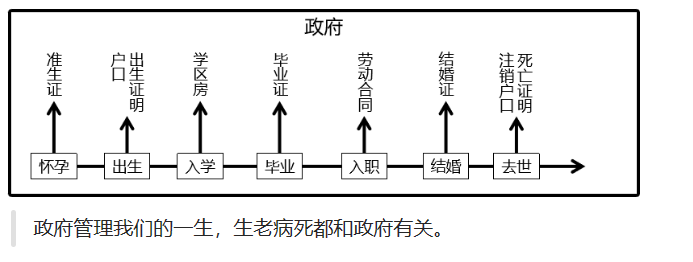
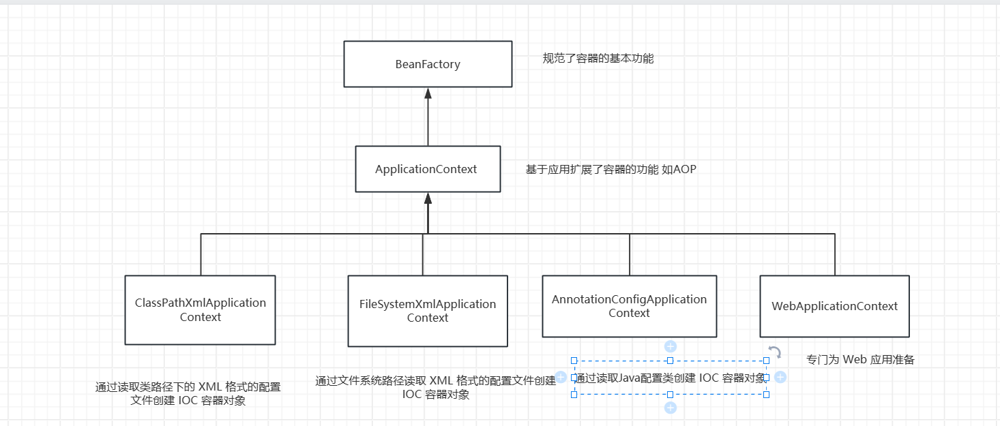

# 第二章 SpringIOC容器核心概念

# 一 容器概念

容器就是存放某种东西的集合

## 1.1普通容器

生活中的容器 ： 水杯

程序中的容器 ：数组 集合

这些都是普通容器，仅仅只能存贮。

## 1.2复杂容器

复杂容器不仅仅是存贮还有管理。

生活中的复杂容器： 

程序中的复杂程序

**Tomcat**容器能够管理 Servlet(init,service,destroy)、Filter、Listener 这样的组件的一生，所以它是一个复杂容器。

**SpringIoC 容器也是一个复杂容器**。它们不仅要负责创建组件的对象、存储组件的对象，还要负责调用组件的方法让它们工作，最终在特定情况下销毁组件。

总结：Spring管理组件的容器，就是一个复杂容器，不仅存储组件，也可以管理组件之间依赖关系，并且创建和销毁组件等！

## 1.3 IoC（Inversion of Control）和DI (Dependency Injection) 

springIOC容器实现的理论就就是IOC和DI

### 1.3.1 IOC(Inversion of Control)控制反转

IoC 主要是针对对象的创建和调用控制而言的，也就是说，当应用程序需要使用一个对象时，不再是应用程序直接创建该对象，而是由 IoC 容器来创建和管理，即控制权由应用程序转移到 IoC 容器中，也就是“反转”了控制权。

Spring IoC 容器，负责实例化、配置和组装 bean（组件）核心容器。容器通过读取配置元数据来获取有关要实例化、配置和组装组件的指令。

### 1.3.2**DI (Dependency Injection) 依赖注入**

DI 是指在组件之间传递依赖关系的过程中，将依赖关系在容器内部进行处理，这样就不必在应用程序代码中硬编码对象之间的依赖关系，实现了对象之间的解耦合。在 Spring 中，DI 是通过 XML 配置文件或注解的方式实现的。它提供了三种形式的依赖注入：构造函数注入、Setter 方法注入和接口注入。

## 1.3为什么使用SpingIOC容器管理组件？

1. 降低了组件之间的耦合性：Spring IoC容器通过依赖注入机制，将组件之间的依赖关系削弱，减少了程序组件之间的耦合性，使得组件更加松散地耦合。
2. 提高了代码的可重用性和可维护性：将组件的实例化过程、依赖关系的管理等功能交给Spring IoC容器处理，使得组件代码更加模块化、可重用、更易于维护。
3. 方便了配置和管理：Spring IoC容器通过XML文件或者注解，轻松的对组件进行配置和管理，使得组件的切换、替换等操作更加的方便和快捷。
4. 交给Spring管理的对象（组件），方可享受Spring框架的其他功能（AOP,声明事务管理）等

# 二 SpringIOC容器介绍

Spring IoC 容器，负责实例化、配置和组装 bean（组件）。容器通过读取配置元数据来获取有关要实例化、配置和组装组件的指令。配置元数据以 XML、Java 注解或 Java 代码形式表现。它允许表达组成应用程序的组件以及这些组件之间丰富的相互依赖关系(DI)。

## 2.1 SpringIOC容器的接口以及实现

**SpringIOC容器的接口：**

`BeanFactory` 接口提供了一种高级配置机制，能够管理任何类型的对象，它是SpringIoC容器标准化超接口！

`ApplicationContext` 是 `BeanFactory` 的子接口。它扩展了以下功能：

- 更容易与 Spring 的 AOP 功能集成
- 消息资源处理（用于国际化）
- 特定于应用程序给予此接口实现，例如Web 应用程序的 `WebApplicationContext`

简而言之， `BeanFactory` 提供了配置框架和基本功能，而 `ApplicationContext` 添加了更多特定于企业的功能。 

**SpringIOC容器实现类：**

| 类型名                             | 简介                                                         |
| ---------------------------------- | ------------------------------------------------------------ |
| ClassPathXmlApplicationContext     | 通过读取类路径下的 XML 格式的配置文件创建 IOC 容器对象       |
| FileSystemXmlApplicationContext    | 通过文件系统路径读取 XML 格式的配置文件创建 IOC 容器对象     |
| AnnotationConfigApplicationContext | 通过读取Java配置类创建 IOC 容器对象                          |
| WebApplicationContext              | 专门为 Web 应用准备，基于 Web 环境创建 IOC 容器对象，并将对象引入存入 ServletContext 域中。 |

## 2.2IOC容器配置方式

Spring框架提供了三种配置方式：XML配置方式、注解方式和Java配置类方式

1. XML配置方式：是Spring框架最早的配置方式之一，通过在XML文件中定义Bean及其依赖关系、Bean的作用域等信息，让Spring IoC容器来管理Bean之间的依赖关系。该方式从Spring框架的第一版开始提供支持。
2. 注解方式：从Spring 2.5版本开始提供支持，可以通过在Bean类上使用注解来代替XML配置文件中的配置信息。通过在Bean类上加上相应的注解（如@Component, @Service, @Autowired等），将Bean注册到Spring IoC容器中，这样Spring IoC容器就可以管理这些Bean之间的依赖关系。
3. **Java配置类**方式：从Spring 3.0版本开始提供支持，通过Java类来定义Bean、Bean之间的依赖关系和配置信息，从而代替XML配置文件的方式。Java配置类是一种使用Java编写配置信息的方式，通过@Configuration、@Bean等注解来实现Bean和依赖关系的配置。
