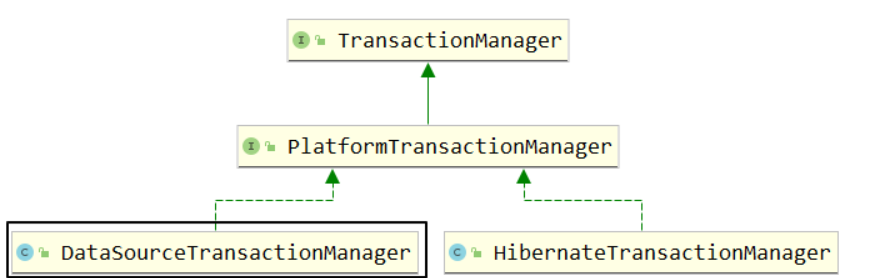
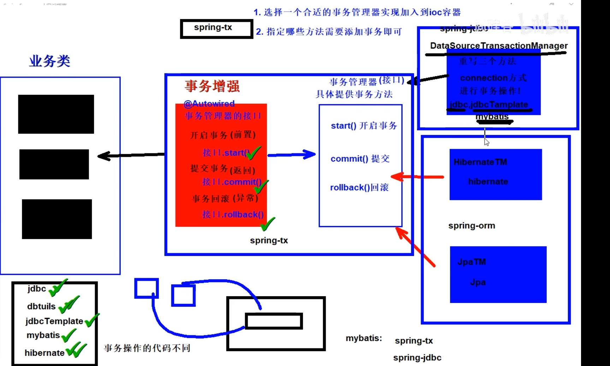

# 第五章 Spring声明式事务

# 一 声明式事务概念

## 1.1 编程式事务

手动编写程序来管理事务，即通过编写代码的方式来实现事务的提交，和回滚。

## 1.2 声明式事务

声明式事务是指使用注解或配置文件来控制事务的提交和回滚。

开发者只需要添加注解或者配置文件，具体的实现通过框架来实现。

使用声明式事务可以将事务的控制和业务逻辑区分开，提高代码的可读性和课维护性.


## 1.3Spring事务管理器

1. Spring声明式事务对应依赖
    - spring-tx: 包含声明式事务实现的基本规范（事务管理器规范接口和事务增强等等）
    - spring-jdbc: 包含DataSource方式事务管理器实现类DataSourceTransactionManager
    - spring-orm: 包含其他持久层框架的事务管理器实现类例如：Hibernate/Jpa等
2. Spring声明式事务对应事务管理器接口

    

    我们现在要使用的事务管理器是org.springframework.jdbc.datasource.DataSourceTransactionManager，将来整合 JDBC方式、JdbcTemplate方式、Mybatis方式的事务实现！

    DataSourceTransactionManager类中的主要方法：

    - doBegin()：开启事务
    - doSuspend()：挂起事务
    - doResume()：恢复挂起的事务
    - doCommit()：提交事务
    - doRollback()：回滚事务


## 1.4 Spring-tx

Spring-tx声明式事务的实现。

spring-tx提供了事务管理器的接口，但是没有实现类。没有实现类的原因是，对数据库操作的技术有很多如jdbc，dbutils，jdbcTemplate,mybatis,hibernate等。不同技术对应的事务方法也不一样。spring就没有提供实现类。

但是在其他包中有事务管理器的接口，根据对数据库操作使用的技术，来选择合适的实现类。

​	如spring-jdb包中的DataSourceTM 类是连接形事务，如jdbc，jdbcTemplate ，mybatis。


作为声明式事务，我们需要做的事情。一选择合适的事务管理器接口的实现类，二选择要事务管理的方法。




## 1.5 搭建环境

dao层

```java
@Repository
public class StudentDao {
    @Autowired
    private JdbcTemplate jdbcTemplate;

    public void updateNameById(String name,Integer id){
        String sql = "update students set name = ? where id = ? ;";
        int rows = jdbcTemplate.update(sql, name, id);
    }

    public void updateAgeById(Integer age,Integer id){
        String sql = "update students set age = ? where id = ? ;";
        jdbcTemplate.update(sql,age,id);
    }
}

```

service层

```java
@Service
public class StudentService {
    @Autowired
    private StudentDao studentDao;

    public void changeInfo(){
        studentDao.updateAgeById(100,1);
        System.out.println("-----------");
        studentDao.updateNameById("test1",1);
    }
}
```

配置类

```java
@Configuration
@ComponentScan({"com.ls.service","com.ls.dao"})
@PropertySource("classpath:jdbc.properties")
public class MainConfig {
    @Value("${jdbc.url}")
    private String url;
    @Value("${jdbc.driver}")
    private String driver;
    @Value("${jdbc.username}")
    private String username;
    @Value("${jdbc.password}")
    private String password;
    @Bean
    public DataSource dataSource(){
        DruidDataSource druidDataSource = new DruidDataSource();
        druidDataSource.setUrl(url);
        druidDataSource.setDriverClassName(driver);
        druidDataSource.setUsername(username);
        druidDataSource.setPassword(password);
        return  druidDataSource;
    }

    @Bean
    public JdbcTemplate jdbcTemplate(DataSource dataSource){
        JdbcTemplate jdbcTemplate = new JdbcTemplate();
        jdbcTemplate.setDataSource(dataSource);
        return jdbcTemplate;
    }
}
```

测试

```java
@SpringJUnitConfig(MainConfig.class)
public class SpringTest {

    @Autowired
    private StudentService studentService;
    @Test
    public void test(){
        studentService.changeInfo();
    }
}
```

环境成功。

# 二 spring-tx的使用

1. 将合适的事务管理器实现类装入ioc容器中

```java
 /**
     * 装配事务管理实现对象
     * @param dataSource
     * @return
     */
    @Bean
    public TransactionManager transactionManager(DataSource dataSource){
        return new DataSourceTransactionManager(dataSource);
    }
```

2. 开启事务注解支持，编写注解

在配置类上添加 @EnableTransactionManagement。开始事务注解支持。

在需要添加事务的方法上添加@Transactional

@Transcational也可以加加在类上，这样类上的所有方法都有事务。

```java
@Service
public class StudentService {
    @Autowired
    private StudentDao studentDao;

    @Transactional
    public void changeInfo(){
        studentDao.updateAgeById(100,1);
        int i = 1 / 0;
        System.out.println("-----------");
        studentDao.updateNameById("test2",1);
    }
}
```


## 2.1 只读模式

 * 只读模式 根据属性 readOnly = false （默认），开启只读模式可以提升查询效率。
 * 但是一般查询没有必要添加事务，为什么还有只读模式？
 * 因为有时候事务是添加在类上了，类中的查询方法要想提升效率，可以使用只读模式。

```java
@Service
@Transactional
public class StudentService {
    @Autowired
    private StudentDao studentDao;

    /**
     * 1. 只读模式 根据属性 readOnly = false 默认
     *      开启只读模式可以提升查询效率.
     *      但是一般查询没有必要添加事务，为什么还有只读模式
     *      因为有时候事务是添加在类上了，类中的查询方法要想提升效率，可以使用只读模式。
     *
     */
  
    public void changeInfo(){
        studentDao.updateAgeById(1000,1);

        System.out.println("-----------");
        studentDao.updateNameById("test222",1);
    }
    
    @Transactional(readOnly = true)
    public void getInfo(){
        //查询
    }
}
```


## 2.2 超时时间

1. 需求

    事务在执行过程中，有可能因为遇到某些问题，导致程序卡住，从而长时间占用数据库资源。而长时间占用资源，大概率是因为程序运行出现了问题（可能是Java程序或MySQL数据库或网络连接等等）。

    此时这个很可能出问题的程序应该被回滚，撤销它已做的操作，事务结束，把资源让出来，让其他正常程序可以执行。

    概括来说就是一句话：超时回滚，释放资源。
    
2. 设置超时时间

timeout 默认：-1，永不超时。

```Java
@Service
public class StudentService {

    @Autowired
    private StudentDao studentDao;

    /**
     * timeout设置事务超时时间,单位秒! 默认: -1 永不超时,不限制事务时间!
     */
    @Transactional(readOnly = false,timeout = 3)
    public void changeInfo(){
        studentDao.updateAgeById(100,1);
        //休眠4秒,等待方法超时!
        try {
            Thread.sleep(4000);
        } catch (InterruptedException e) {
            throw new RuntimeException(e);
        }
        studentDao.updateNameById("test1",1);
    }
}

```
3. 测试超时效果

    执行抛出事务超时异常

```Java
org.springframework.transaction.TransactionTimedOutException: Transaction timed out: deadline was Wed May 24 09:10:43 IRKT 2023

  at org.springframework.transaction.support.ResourceHolderSupport.checkTransactionTimeout(ResourceHolderSupport.java:155)
  at org.springframework.transaction.support.ResourceHolderSupport.getTimeToLiveInMillis(ResourceHolderSupport.java:144)
  at org.springframework.transaction.support.ResourceHolderSupport.getTimeToLiveInSeconds(ResourceHolderSupport.java:128)
  at org.springframework.jdbc.datasource.DataSourceUtils.applyTimeout(DataSourceUtils.java:341)
  at org.springframework.jdbc.core.JdbcTemplate.applyStatementSettings(JdbcTemplate.java:1467)

```

* 需要注意的是如果在类上设置了超时时间，但是在方法上有重新设置了事务，此时方法上的事务会覆盖类上的事务。如果类上事务设置了超时时间，但是方法上设置事务，但是没设置超时时间，此时就该方法的事务就无超时间。

##  2.3事务属性：事务异常
  1. 默认情况

      默认只针对运行时异常回滚，编译时异常不回滚。情景模拟代码如下：

```Java
@Service
public class StudentService {

    @Autowired
    private StudentDao studentDao;

    /**
     * timeout设置事务超时时间,单位秒! 默认: -1 永不超时,不限制事务时间!
     * rollbackFor = 指定哪些异常才会回滚,默认是 RuntimeException and Error 异常方可回滚!
     * noRollbackFor = 指定哪些异常不会回滚, 默认没有指定,如果指定,应该在rollbackFor的范围内!
     */
    @Transactional(readOnly = false,timeout = 3)
    public void changeInfo() throws FileNotFoundException {
        studentDao.updateAgeById(100,1);
        //主动抛出一个检查异常,测试! 发现不会回滚,因为不在rollbackFor的默认范围内! 
        new FileInputStream("xxxx");
        studentDao.updateNameById("test1",1);
    }
}
```
  2. 设置回滚异常

      rollbackFor属性：指定哪些异常类才会回滚,默认是 RuntimeException and Error 异常方可回滚!

```Java
/**
 * timeout设置事务超时时间,单位秒! 默认: -1 永不超时,不限制事务时间!
 * rollbackFor = 指定哪些异常才会回滚,默认是 RuntimeException and Error 异常方可回滚!
 * noRollbackFor = 指定哪些异常不会回滚, 默认没有指定,如果指定,应该在rollbackFor的范围内!
 */
@Transactional(readOnly = false,timeout = 3,rollbackFor = Exception.class)
public void changeInfo() throws FileNotFoundException {
    studentDao.updateAgeById(100,1);
    //主动抛出一个检查异常,测试! 发现不会回滚,因为不在rollbackFor的默认范围内! 
    new FileInputStream("xxxx");
    studentDao.updateNameById("test1",1);
}
```
  3. 设置不回滚的异常

      在默认设置和已有设置的基础上，再指定一个异常类型，碰到它不回滚。

      noRollbackFor属性：指定哪些异常不会回滚, 默认没有指定,如果指定,应该在rollbackFor的范围内!

```Java
@Service
public class StudentService {

    @Autowired
    private StudentDao studentDao;

    /**
     * timeout设置事务超时时间,单位秒! 默认: -1 永不超时,不限制事务时间!
     * rollbackFor = 指定哪些异常才会回滚,默认是 RuntimeException and Error 异常方可回滚!
     * noRollbackFor = 指定哪些异常不会回滚, 默认没有指定,如果指定,应该在rollbackFor的范围内!
     */
    @Transactional(readOnly = false,timeout = 3,rollbackFor = Exception.class,noRollbackFor = FileNotFoundException.class)
    public void changeInfo() throws FileNotFoundException {
        studentDao.updateAgeById(100,1);
        //主动抛出一个检查异常,测试! 发现不会回滚,因为不在rollbackFor的默认范围内!
        new FileInputStream("xxxx");
        studentDao.updateNameById("test1",1);
    }
}

```

## 2.4 事务属性：事务隔离级别
  1. 事务隔离级别

      数据库事务的隔离级别是指在多个事务并发执行时，数据库系统为了保证数据一致性所遵循的规定。常见的隔离级别包括：

      1. 读未提交（Read Uncommitted）：事务可以读取未被提交的数据，容易产生脏读、不可重复读和幻读等问题。实现简单但不太安全，一般不用。
      2. 读已提交（Read Committed）：事务只能读取已经提交的数据，可以避免脏读问题，但可能引发不可重复读和幻读。
      3. 可重复读（Repeatable Read）：在一个事务中，相同的查询将返回相同的结果集，不管其他事务对数据做了什么修改。可以避免脏读和不可重复读，但仍有幻读的问题。
      4. 串行化（Serializable）：最高的隔离级别，完全禁止了并发，只允许一个事务执行完毕之后才能执行另一个事务。可以避免以上所有问题，但效率较低，不适用于高并发场景。

      不同的隔离级别适用于不同的场景，需要根据实际业务需求进行选择和调整。
  2. 事务隔离级别设置

```Java
package com.atguigu.service;

import com.atguigu.dao.StudentDao;
import org.springframework.beans.factory.annotation.Autowired;
import org.springframework.stereotype.Service;
import org.springframework.transaction.annotation.Isolation;
import org.springframework.transaction.annotation.Transactional;

import java.io.FileInputStream;
import java.io.FileNotFoundException;

/**
 * projectName: com.atguigu.service
 */
@Service
public class StudentService {

    @Autowired
    private StudentDao studentDao;

    /**
     * timeout设置事务超时时间,单位秒! 默认: -1 永不超时,不限制事务时间!
     * rollbackFor = 指定哪些异常才会回滚,默认是 RuntimeException and Error 异常方可回滚!
     * noRollbackFor = 指定哪些异常不会回滚, 默认没有指定,如果指定,应该在rollbackFor的范围内!
     * isolation = 设置事务的隔离级别,mysql默认是repeatable read!
     */
    @Transactional(readOnly = false,
                   timeout = 3,
                   rollbackFor = Exception.class,
                   noRollbackFor = FileNotFoundException.class,
                   isolation = Isolation.REPEATABLE_READ)
    public void changeInfo() throws FileNotFoundException {
        studentDao.updateAgeById(100,1);
        //主动抛出一个检查异常,测试! 发现不会回滚,因为不在rollbackFor的默认范围内!
        new FileInputStream("xxxx");
        studentDao.updateNameById("test1",1);
    }
}

```

## 2.5 事务属性：事务传播行为
  1. 事务传播行为要研究的问题

      

      举例代码：

```Java
@Transactional
public void MethodA(){
    // ...
    MethodB();
    // ...
}

//在被调用的子方法中设置传播行为，代表如何处理调用的事务！ 是加入，还是新事务等！
@Transactional(propagation = Propagation.REQUIRES_NEW)
public void MethodB(){
    // ...
}

```
  2. propagation属性

      @Transactional 注解通过 propagation 属性设置事务的传播行为。它的默认值是：

```Java
Propagation propagation() default Propagation.REQUIRED;

```

      propagation 属性的可选值由 org.springframework.transaction.annotation.Propagation 枚举类提供：

| 名称             | 含义                                               |
| ---------------- | -------------------------------------------------- |
| REQUIRED  默认值 | 如果父方法有事务，就加入，如果没有就新建自己独立！ |
| REQUIRES_NEW     | 不管父方法是否有事务，我都新建事务，都是独立的！   |

  3. 测试
      1. 声明两个业务方法

```Java
@Service
public class StudentService {

    @Autowired
    private StudentDao studentDao;

    /**
     * timeout设置事务超时时间,单位秒! 默认: -1 永不超时,不限制事务时间!
     * rollbackFor = 指定哪些异常才会回滚,默认是 RuntimeException and Error 异常方可回滚!
     * noRollbackFor = 指定哪些异常不会回滚, 默认没有指定,如果指定,应该在rollbackFor的范围内!
     * isolation = 设置事务的隔离级别,mysql默认是repeatable read!
     */
    @Transactional(readOnly = false,
                   timeout = 3,
                   rollbackFor = Exception.class,
                   noRollbackFor = FileNotFoundException.class,
                   isolation = Isolation.REPEATABLE_READ)
    public void changeInfo() throws FileNotFoundException {
        studentDao.updateAgeById(100,1);
        //主动抛出一个检查异常,测试! 发现不会回滚,因为不在rollbackFor的默认范围内!
        new FileInputStream("xxxx");
        studentDao.updateNameById("test1",1);
    }
    

    /**
     * 声明两个独立修改数据库的事务业务方法
     */
    @Transactional(propagation = Propagation.REQUIRED)
    public void changeAge(){
        studentDao.updateAgeById(99,1);
    }

    @Transactional(propagation = Propagation.REQUIRED)
    public void changeName(){
        studentDao.updateNameById("test2",1);
        int i = 1/0;
    }

}
```
      2. 声明一个整合业务方法

```Java
@Service
public class TopService {

    @Autowired
    private StudentService studentService;

    @Transactional
    public void  topService(){
        studentService.changeAge();
        studentService.changeName();
    }
}

```
      3. 添加传播行为测试

```Java
@SpringJUnitConfig(classes = AppConfig.class)
public class TxTest {

    @Autowired
    private StudentService studentService;

    @Autowired
    private TopService topService;

    @Test
    public void  testTx() throws FileNotFoundException {
        topService.topService();
    }
}

```

      **注意：**
    
        在同一个类中，对于@Transactional注解的方法调用，事务传播行为不会生效。这是因为Spring框架中使用代理模式实现了事务机制，在同一个类中的方法调用并不经过代理，而是通过对象的方法调用，因此@Transactional注解的设置不会被代理捕获，也就不会产生任何事务传播行为的效果。
  4. 其他传播行为值（了解）
      1. Propagation.REQUIRED：如果当前存在事务，则加入当前事务，否则创建一个新事务。
      2. Propagation.REQUIRES_NEW：创建一个新事务，并在新事务中执行。如果当前存在事务，则挂起当前事务，即使新事务抛出异常，也不会影响当前事务。
      3. Propagation.NESTED：如果当前存在事务，则在该事务中嵌套一个新事务，如果没有事务，则与Propagation.REQUIRED一样。
      4. Propagation.SUPPORTS：如果当前存在事务，则加入该事务，否则以非事务方式执行。
      5. Propagation.NOT_SUPPORTED：以非事务方式执行，如果当前存在事务，挂起该事务。
      6. Propagation.MANDATORY：必须在一个已有的事务中执行，否则抛出异常。
      7. Propagation.NEVER：必须在没有事务的情况下执行，否则抛出异常。