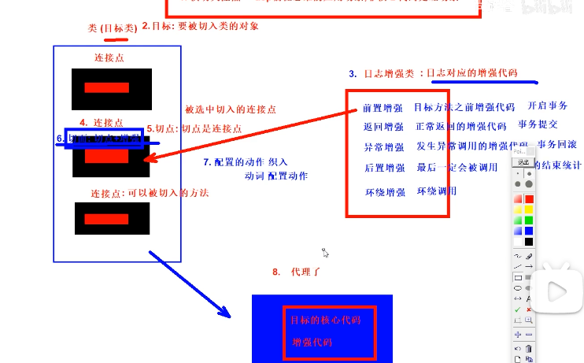
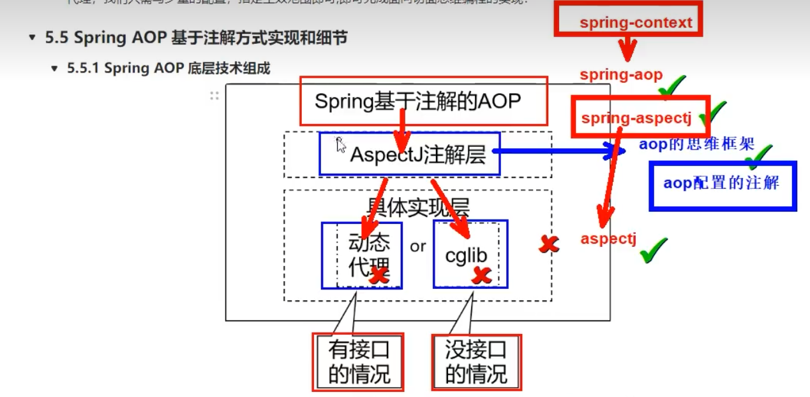
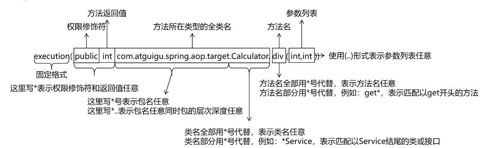

# 四 AOP的概念以及使用

# 一 Aop的场景复现

* 在执行方法时，我们总是需要去记录，执行前，和执行后，来判断执行是否出错，例如日志。
* 按照以上要求我们总是在方法执行前和执行后，去记录参数和结果，每个方法都需要去记录，我们难道每次都要写吗？


如下案例

```java
/**
 *       + - * / 运算的标准接口!
 */
public interface Calculator {
    
    int add(int i, int j);
    
    int sub(int i, int j);
    
    int mul(int i, int j);
    
    int div(int i, int j);
    
}


/**
 * 实现计算接口,单纯添加 + - * / 实现! 掺杂其他功能!
 */
public class CalculatorPureImpl implements Calculator {
    
    @Override
    public int add(int i, int j) {
    
        int result = i + j;
    
        return result;
    }
    
    @Override
    public int sub(int i, int j) {
    
        int result = i - j;
    
        return result;
    }
    
    @Override
    public int mul(int i, int j) {
    
        int result = i * j;
    
        return result;
    }
    
    @Override
    public int div(int i, int j) {
    
        int result = i / j;
    
        return result;
    }
}
```

* 我们需要查看方法执行的参数，以及结果，最简单的办法就是在方法内，添加输出参数和结果，两个语句。

```java
public class CalculatorPureImpl implements Calculator {
    
    @Override
    public int add(int i, int j) {
        System.out.println("i = " + i + ", j = " + j);
        int result = i + j;
        System.out.println("result = " + result);
        return result;
    }
    
    @Override
    public int sub(int i, int j) {
        System.out.println("i = " + i + ", j = " + j);
        int result = i - j;
        System.out.println("result = " + result);
        return result;
    }
    
    @Override
    public int mul(int i, int j) {
        System.out.println("i = " + i + ", j = " + j);
        int result = i * j;
        System.out.println("result = " + result);
        return result;
    }
    
    @Override
    public int div(int i, int j) {
        System.out.println("i = " + i + ", j = " + j);
        int result = i / j;
        System.out.println("result = " + result);
        return result;
    }
}
```

1. 代码问题分析
    1. 代码缺陷
        - 对核心业务功能有干扰，导致程序员在开发核心业务功能时分散了精力
        - 附加功能代码重复，分散在各个业务功能方法中！冗余，且不方便统一维护！
    2. 解决思路

          核心就是：解耦。我们需要把附加功能从业务功能代码中抽取出来。

          将重复的代码统一提取，并且[[动态插入]]到每个业务方法！
    3. 技术困难

        解决问题的困难：提取重复附加功能代码到一个类中，可以实现

        但是如何将代码插入到各个方法中，我们不会，我们需要引用新技术！！！


# 二 静态代理和动态代理

## 2.1 代理模式

* 它的作用就是通过提供一个代理类，让我们在调用目标方法的时候，不再是直接对目标方法进行调用，而是通过代理类间接调用。让不属于目标方法核心逻辑的代码从目标方法中剥离出来——解耦。调用目标方法时先调用代理对象的方法，减少对目标方法的调用和打扰，同时让附加功能能够集中在一起也有利于统一维护。
* 代理就是，将目的类的非核心代码抽离出来，在代理类中引入目标类，并使用目标类的方法。


## 2.2静态代理

主动创建代理类：

```Java
public class CalculatorStaticProxy implements Calculator {
    
    // 将被代理的目标对象声明为成员变量
    private Calculator target;
    
    public CalculatorStaticProxy(Calculator target) {
        this.target = target;
    }
    
    @Override
    public int add(int i, int j) {
    
        // 附加功能由代理类中的代理方法来实现
        System.out.println("参数是：" + i + "," + j);
    
        // 通过目标对象来实现核心业务逻辑
        int addResult = target.add(i, j);
    
        System.out.println("方法内部 result = " + result);
    
        return addResult;
    }
```

静态代理确实实现了解耦，但是由于代码都写死了，完全不具备任何的灵活性。就拿日志功能来说，将来其他地方也需要附加日志，那还得再声明更多个静态代理类，那就产生了大量重复的代码，日志功能还是分散的，没有统一管理。

提出进一步的需求：将日志功能集中到一个代理类中，将来有任何日志需求，都通过这一个代理类来实现。这就需要使用动态代理技术了。

## 2.3动态代理

1. **动态代理**

    动态代理技术分类

    - JDK动态代理：JDK原生的实现方式，需要被代理的目标类必须**实现接口**！他会根据目标类的接口动态生成一个代理对象！代理对象和目标对象有相同的接口！（拜把子）
    - cglib：通过继承被代理的目标类实现代理，所以不需要目标类实现接口！（认干爹）

     代理工长：基于jdk代理技术，生成代理对象

```Java
public class ProxyFactory {

    private Object target;

    public ProxyFactory(Object target) {
        this.target = target;
    }

    public Object getProxy(){

        /**
         * newProxyInstance()：创建一个代理实例
         * 其中有三个参数：
         * 1、classLoader：加载动态生成的代理类的类加载器
         * 2、interfaces：目标对象实现的所有接口的class对象所组成的数组
         * 3、invocationHandler：设置代理对象实现目标对象方法的过程，即代理类中如何重写接口中的抽象方法
         */
        ClassLoader classLoader = target.getClass().getClassLoader();
        Class<?>[] interfaces = target.getClass().getInterfaces();
        InvocationHandler invocationHandler = new InvocationHandler() {
            @Override
            public Object invoke(Object proxy, Method method, Object[] args) throws Throwable {
                /**
                 * proxy：代理对象
                 * method：代理对象需要实现的方法，即其中需要重写的方法
                 * args：method所对应方法的参数
                 */
                Object result = null;
                try {
                    System.out.println("[动态代理][日志] "+method.getName()+"，参数："+ Arrays.toString(args));
                    result = method.invoke(target, args);
                    System.out.println("[动态代理][日志] "+method.getName()+"，结果："+ result);
                } catch (Exception e) {
                    e.printStackTrace();
                    System.out.println("[动态代理][日志] "+method.getName()+"，异常："+e.getMessage());
                } finally {
                    System.out.println("[动态代理][日志] "+method.getName()+"，方法执行完毕");
                }
                return result;
            }
        };

        return Proxy.newProxyInstance(classLoader, interfaces, invocationHandler);
    }
}
```

2. **代理总结**

    **代理方式可以解决附加功能代码干扰核心代码和不方便统一维护的问题！**

    他主要是将附加功能代码提取到代理中执行，不干扰目标核心代码！

    但是我们也发现，无论使用静态代理和动态代理(jdk,cglib)，程序员的工作都比较繁琐！

    需要自己编写代理工厂等！但是我们在实际开发中，不需要编写代理代码，我们可以使用[Spring AOP]框架，

    他会简化动态代理的实现！！！


# 三 springAop的概念

Aop面向切面编程，是oop的补充。将非核心代码（重复代码）抽取出来生成单独类，然后执行方法时，插入非核心代码。

1. **AOP思想主要的应用场景**

    AOP（面向切面编程）是一种编程范式，它通过将通用的横切关注点（如日志、事务、权限控制等）与业务逻辑分离，使得代码更加清晰、简洁、易于维护。AOP可以应用于各种场景，以下是一些常见的AOP应用场景：

    1. 日志记录：在系统中记录日志是非常重要的，可以使用AOP来实现日志记录的功能，可以在方法执行前、执行后或异常抛出时记录日志。
    2. 事务处理：在数据库操作中使用事务可以保证数据的一致性，可以使用AOP来实现事务处理的功能，可以在方法开始前开启事务，在方法执行完毕后提交或回滚事务。
    3. 安全控制：在系统中包含某些需要安全控制的操作，如登录、修改密码、授权等，可以使用AOP来实现安全控制的功能。可以在方法执行前进行权限判断，如果用户没有权限，则抛出异常或转向到错误页面，以防止未经授权的访问。
    4. 性能监控：在系统运行过程中，有时需要对某些方法的性能进行监控，以找到系统的瓶颈并进行优化。可以使用AOP来实现性能监控的功能，可以在方法执行前记录时间戳，在方法执行完毕后计算方法执行时间并输出到日志中。
    5. 异常处理：系统中可能出现各种异常情况，如空指针异常、数据库连接异常等，可以使用AOP来实现异常处理的功能，在方法执行过程中，如果出现异常，则进行异常处理（如记录日志、发送邮件等）。
    6. 缓存控制：在系统中有些数据可以缓存起来以提高访问速度，可以使用AOP来实现缓存控制的功能，可以在方法执行前查询缓存中是否有数据，如果有则返回，否则执行方法并将方法返回值存入缓存中。
    7. 动态代理：AOP的实现方式之一是通过动态代理，可以代理某个类的所有方法，用于实现各种功能。

    综上所述，AOP可以应用于各种场景，它的作用是将通用的横切关注点与业务逻辑分离，使得代码更加清晰、简洁、易于维护。

1. **AOP术语名词介绍**

    1-横切关注点

    从每个方法中抽取出来的同一类非核心业务。在同一个项目中，我们可以使用多个横切关注点对相关方法进行多个不同方面的增强。

    这个概念不是语法层面天然存在的，而是根据附加功能的逻辑上的需要：有十个附加功能，就有十个横切关注点。

    

    AOP把软件系统分为两个部分：核心关注点和横切关注点。业务处理的主要流程是核心关注点，与之关系不大的部分是横切关注点。横切关注点的一个特点是，他们经常发生在核心关注点的多处，而各处基本相似，比如权限认证、日志、事务、异常等。AOP的作用在于分离系统中的各种关注点，将核心关注点和横切关注点分离开来。

    2-通知(增强)

    每一个横切关注点上要做的事情都需要写一个方法来实现，这样的方法就叫通知方法。

    - 前置通知：在被代理的目标方法前执行
    - 返回通知：在被代理的目标方法成功结束后执行（**寿终正寝**）
    - 异常通知：在被代理的目标方法异常结束后执行（**死于非命**）
    - 后置通知：在被代理的目标方法最终结束后执行（**盖棺定论**）
    - 环绕通知：使用try...catch...finally结构围绕整个被代理的目标方法，包括上面四种通知对应的所有位置

    

    

    3-连接点 joinpoint

    这也是一个纯逻辑概念，不是语法定义的。

    指那些被拦截到的点。在 Spring 中，可以被动态代理拦截目标类的方法

    

    4-切入点 pointcut

    定位连接点的方式，或者可以理解成被选中的连接点！

    是一个表达式，比如execution(* com.spring.service.impl.*.*(..))。符合条件的每个方法都是一个具体的连接点。

    

    5-切面 aspect

    切入点和通知的结合。是一个类。

    

    6-目标 target

    被代理的目标对象。

    7-代理 proxy

    向目标对象应用通知之后创建的代理对象。

    8-织入 weave

    指把通知应用到目标上，生成代理对象的过程。可以在编译期织入，也可以在运行期织入，Spring采用后者。



# 四 SpringAOP的使用

## 4.1 SpringAOP的底层技术



- 动态代理（InvocationHandler）：JDK原生的实现方式，需要被代理的目标类必须实现接口。因为这个技术要求代理对象和目标对象实现同样的接口（兄弟两个拜把子模式）。
- cglib：通过继承被代理的目标类（认干爹模式）实现代理，所以不需要目标类实现接口，已经和spring融合不需要导入jar包。
- AspectJ：早期的AOP实现的框架，SpringAOP借用了AspectJ中的AOP注解   spring-aspectj-jar。


## 4.2快速使用

sevice层

```java
/**
 *       + - * / 运算的标准接口!
 */
public interface Calculator {
    
    int add(int i, int j);
    
    int sub(int i, int j);
    
    int mul(int i, int j);
    
    int div(int i, int j);
    
}

/**
 * 实现计算接口,单纯添加 + - * / 实现! 掺杂其他功能!
 */

@Service
public class CalculatorPureImpl implements Calculator {
    
    @Override
    public int add(int i, int j) {

        int result = i + j;

        return result;
    }
    
    @Override
    public int sub(int i, int j) {

        int result = i - j;

        return result;
    }
    
    @Override
    public int mul(int i, int j) {

        int result = i * j;

        return result;
    }
    
    @Override
    public int div(int i, int j) {

        int result = i / j;

        return result;
    }
}


```

增强方法

```java
/**
 *  1. 定义方法的增强方法
 *       根据核心代码，需要执行非核心代码的插入位置，编写对应的方法 *
 *  2. 使用注解配置，插入目标方法的位置
 *      前置 @Before
 *      后置 @AfterReturning
 *      异常 @AfterThrowing
 *      结束 @After
 *      环绕 @Around
 *
 *   3. 配置切点 --->切点表达式
 *
 *
 *   4. 补全注解
 *         加入ioc容器 @Component
 *         配置切面   @Aspect
 *
 *    5. 开启AspectJ 注解
 *      xml  <aop:aspectj-autoproxy/>
 *      配置类 @EnableAspectJAutoProxy
 *
 *
 */
@Aspect
@Component
public class Log {

    @Before("execution(* com.ls.service.CalculatorPureImpl.*(..))")
    public  void start(){
        System.out.println("方法开始");
    }

    @AfterReturning("execution(* com.ls.service.CalculatorPureImpl.*(..))")
    public void after(){
        System.out.println("方法结束");
    }

    @AfterThrowing("execution(* com.ls.service.CalculatorPureImpl.*(..))")
    public void error(){
        System.out.println("方法报错");
    }
}
```

配置类

```java
@Configuration
@ComponentScan({"com.ls.service","com.ls.advice"})
@EnableAspectJAutoProxy//开启AspectJ注解支持 xml- <aop:aspectj-autoproxy/>
public class MainConfig {
}
```

test

```java
@SpringJUnitConfig(value = MainConfig.class)
public class SpringAopTest {
    //aop - 代理 -jdk -接口- 代理类，代理对象和目标对象,只能用接口接值
    //这里不能用实现类接值。因为使用了jdk代理技术，代理的实现是接口实现，目标类和代理类无直接关系。
    @Autowired
    private Calculator calculator;

    @Test
    public void test1(){
        int add = calculator.add(1, 1);
        System.out.println("add = " + add);
    }

}
```

**思路过一遍**

* 由于OOP的代码冗余，使用AOP抽离非核心代码。在核心代码运行的使用也执行抽离出来的非核心代码------->即使用代理技术。SpringAOP中只需要我们编写配置，会自动帮我们代理。代理的底层是jdk和cglib。当我们目标类有接口的时候，springaop会使用jdk代理，根据接口生成代理类。我们只需要关注如何编写配置让spring帮助我们生成代理类。

*  使用AspectJ注解并且在spring配置中开启AspectJ注解支持。编写增强方法并设置切点。
* 增强类也要放到ioc容器管理
* 需要注意的是，使用接口对代理接受数据。


## 4.3 增强方法获得核心方法的信息

通过JointPoint 类来获取目标方法的所有信息，JoinPoint类是AspectJ中的是实现类，来存贮目标方法的信息。

核心方法的信息除了整个JointPoint,在执行过程中会有返回值和异常。

获得返回值信息需要在AfterReturing时，用参数Object 来接受返回结果在@AfterReturning("切入点"，returning = “参数名”)中属性returning中指定参数名。

异常信息需要在@AfterThrowing中方法中用参数Throwable 来接受，在@AfterThrowing中属性throwing=“参数名”来指定，返回异常信息的接受参数。

```java
** 获得目标方法的信息
 *      任何增强方法都可以获得  目标方法的类名 方法名，参数。
 *       JoinPoint    import org.aspectj.lang.JoinPoint;
 *      1. 目标方法的类名
 *          joinPoint.getTarget().getClass().getName();
 *      2. 目标方法名以及方法的访问修饰符
 *          joinPoint.getSignature().getName();
 *          joinPoint.getSignature().getModifier();//需要注意的是，返回值是整数，
 *                   int modifiers = joinPoint.getSignature().getModifiers();
 *                    String string = Modifier.toString(modifiers);
 *
 *
 *      3.返回值 @AfterReturning
 *      1. @AfterReturning("execution(xxx)",returning = "自定义参数名")
 *      2. 在增强方法中传参 public void afterReturning(Object 自定义参数名)
 *
 *      4.异常信息 @AfterThrowing
 *       1.   @AfterThrowing(value = "execution(* com.ls.service.CalculatorPureImpl.*(..))",throwing = "error")
 *       2. public void afterThrowing(Throwable error)
 *
 */
@Aspect
@Component
public class MyAdvice {
    @Before("execution(* com.ls.service.CalculatorPureImpl.*(..))")
    public  void before(JoinPoint joinPoint){
        //获得目标类的类名
        String name = joinPoint.getTarget().getClass().getName();
        System.out.println("name = " + name);
        //方法的访问修饰符
        int modifiers = joinPoint.getSignature().getModifiers();
        String string = Modifier.toString(modifiers);
        System.out.println("joinPoint = " + joinPoint);
        //方法名称
        String name1 = joinPoint.getSignature().getName();
        System.out.println("joinPoint = " + joinPoint);
        //参数列表
        Object[] args = joinPoint.getArgs();
        System.out.println("args = " + args);

        System.out.println("before");
    }

    @AfterReturning(value = "execution(* com.ls.service.CalculatorPureImpl.*(..))",returning = "result")
    public void afterReturning(Object result){
        System.out.println("result = " + result);
        System.out.println("方法结束");
    }

    @AfterThrowing(value = "execution(* com.ls.service.CalculatorPureImpl.*(..))",throwing = "error")
    public void afterThrowing(Throwable error){
        System.out.println("方法报错");
    }
    @After("execution(* com.ls.service.CalculatorPureImpl.*(..))")
    public void after(){
        System.out.println("方法关闭");
    }
}

```

## 4.4 切点表达式

* AOP切点表达式（Pointcut Expression）是一种用于指定切点的语言，它可以通过定义匹配规则，来选择需要被切入的目标对象。




- 第一位：方法访问修饰符

```Java
public private 直接描述对应修饰符即可
```
- 第二位：方法返回值

```Java
int String void 直接描述返回值类型
```

注意： 当前两位都不考虑的时候才能用*代替两位。

- 第三位：指定包的地址

 固定的包: com.ls.dao
 单层的任意命名: com.ls.*  = com.ls.pojo  com.ls.dao   任意一层的任意命名
 任意层任意命名: com.. = com.ls.a com.sl.a  ..任意层,任意命名 用在包上!
 注意: ..不能用作包开头   public int .. 错误语法  com..  找到任何包下: *..

- 第四位：指定类名称

固定名称: UserService
任意类名: *
部分任意: com..service.impl.*Impl
任意包任意类: *..*


- 第五位：指定方法名称

语法和类名一致
任意访问修饰符,任意类的任意方法: * *..*.*

- 第七位：方法参数

第七位: 方法的参数描述
      没有参数 ()
       模糊值: 任意参数 有 或者 没有 (..)  ..任意参数的意识
       部分具体和模糊:
       第一个参数是字符串的方法 (String..)
       最后一个参数是字符串 (..String)
       字符串开头,int结尾 (String..int)
       包含int类型(..int..)

## 4.5 切点表达式的提取

由于我们会复用切点表达式。在增强方法中直接编写切点表达式，就不方便更改，以及复用。

我们可以提取出相同的切点表达式，制作成一个切点方法。在给增强方法编写切点时直接引入就好。

1. 制作切点方法

@Pointcut

```java
// 切入点表达式
@Pointcut("execution(public int com.ls.aop.api.Calculator.add(int,int)))")
public void declarPointCut() {}
```

* 需要注意的时存放切点的方法必须时 public void 修饰

2. 引用切点方法

```java
//切点方法和增强方法在同一类中
@Before(value = "declarPointCut()")
public void printLogBeforeCoreOperation(JoinPoint joinPoint) {
//切点方法和增强方法在不在同一类中
@Before(value = "com.atguigu.spring.aop.aspect.LogAspect.declarPointCut()")
public Object roundAdvice(ProceedingJoinPoint joinPoint) {
```

为了更好的管理切点。我们可以将所有的切点方法单独提取出来，存放在一个包里，更方便管理.

## 4.6 优先增强类

当对一个目标方法有多个增强方法，且位置一样时。怎么来确保那个增强方法先执行？

在增强类上可以使用@Order（数字），数字越小，优先级越高，前置方法就越先执行，后置方法就越后执行。

